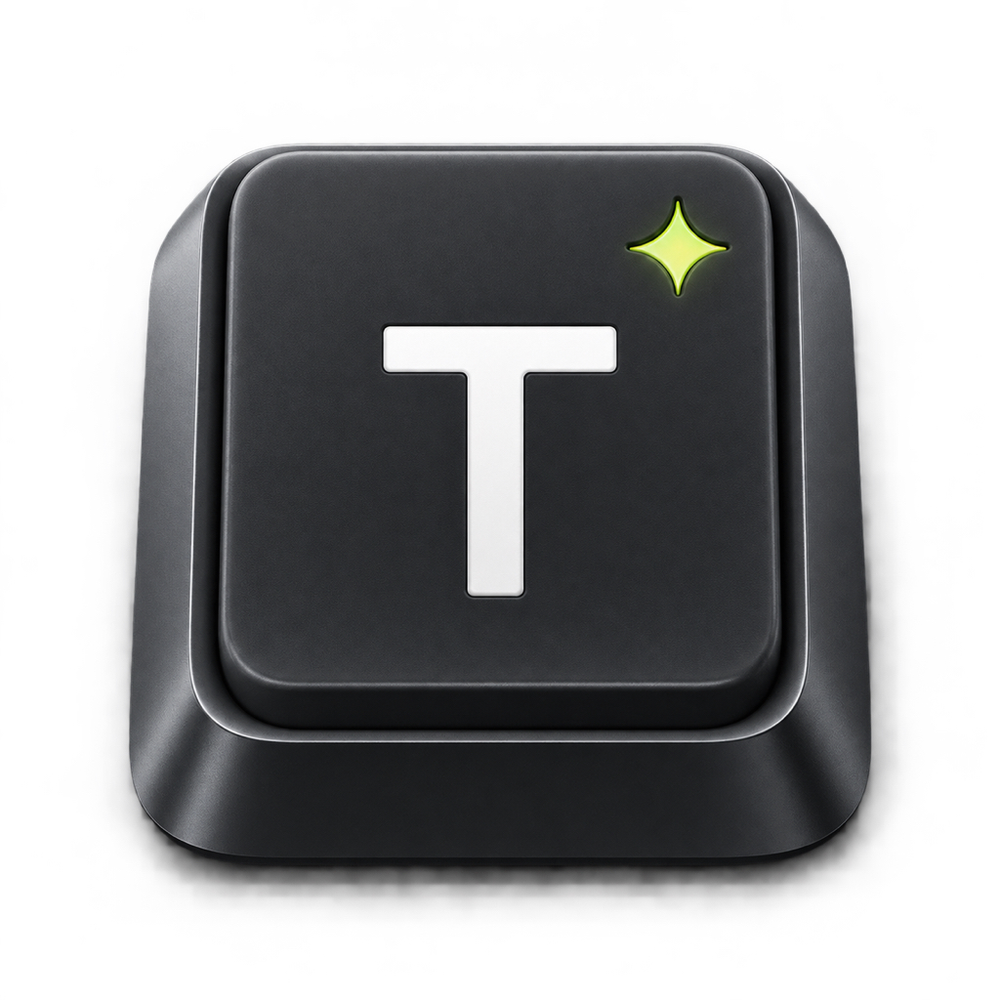

<p align="center">
  
</p>

<h1 align="center">TILOQ</h1>

<p align="center"><strong>Write. Fix. Done.</strong></p>

<p align="center">
  A tactile, private iPhone keyboard for fast writing improvements powered by Apple Intelligence on your device.
</p>

## What is TILOQ?

TILOQ is a focused iOS keyboard that improves selected text without opening a chatbot or exposing complicated AI controls.

Select text, choose one action, review the result, and insert it:

- **Rewrite** — adjust wording with Casual, Professional, Friendly, or Shorter tones
- **Grammar** — correct grammar, spelling, punctuation, and capitalization
- **Improve** — improve clarity, flow, and word choice
- **Encrypt** — optionally encrypt selected text using your own shared key text

The interface is intentionally compact: a normal QWERTY keyboard, three focused writing tools, and a small result panel.

## Highlights

- Pure Swift and SwiftUI—no React Native, web runtime, or third-party SDKs
- On-device writing transformations with Apple's Foundation Models framework
- Complete keyboard layers for letters, numbers, and symbols
- Suggestions, auto-capitalization, key previews, alternate characters, and cursor mode
- Repeating delete, double-space period, caps lock, haptics, and globe-key switching
- Optional animated per-key RGB lighting and local keyboard backdrops
- AES-GCM text encryption and a companion decryption screen
- No account, advertising, analytics, or TILOQ writing server
- Full Access is not required

## Requirements

- iPhone running iOS 26 or later
- Xcode 26 or later
- An Apple Intelligence-compatible device with Apple Intelligence enabled for Rewrite, Grammar, and Improve
- An Apple Developer team for physical-device installation and distribution

Typing and encryption remain available when Apple Intelligence is unavailable. TILOQ displays the local model status and never substitutes sample copy for the user's selected text.

## Getting started

1. Open `Tiloq.xcodeproj` in Xcode.
2. Select the **TiloqApp** scheme.
3. Set your development team for both **TiloqApp** and **TypeKeyboard**.
4. Confirm that both targets use the same App Group entitlement.
5. Build and run TILOQ on an iPhone.

Enable the keyboard on the device:

1. Open **Settings → General → Keyboard → Keyboards**.
2. Tap **Add New Keyboard**.
3. Select **TILOQ**.
4. Open a text field in Messages, Mail, Notes, Safari, or another app.
5. Hold the globe key and choose TILOQ.

TILOQ does not request Full Access. iOS does not allow third-party keyboards to permanently remove Apple's system keyboard; users switch keyboards with the globe key.

## Using the writing tools

1. Select text in the host app.
2. Switch to the TILOQ keyboard.
3. Tap **Rewrite**, **Grammar**, or **Improve**.
4. Review the on-device result.
5. Tap **Insert** to replace the selection, or **Copy** to use it elsewhere.

AI availability depends on the device, language, region, and Apple Intelligence system settings.

## Private text encryption

Encryption is an optional, lightweight feature for sharing encrypted text:

1. Enable **Encryption** in TILOQ Settings.
2. Enter your own key text.
3. Select text and tap **Encrypt** on the keyboard.
4. Insert the generated `TILOQ1.` message.
5. The recipient opens TILOQ's **Decrypt** tab and enters the exact same key text.

TILOQ derives a 256-bit key from custom key text and encrypts with CryptoKit AES-GCM. Key text is stored locally in the shared App Group container. There is no account recovery, so a lost key cannot be recovered by TILOQ.

This feature is designed for simple private messages, not identity verification or enterprise key management. Share key text separately and only with people you trust.

## Privacy

TILOQ is designed around local processing:

- Writing transformations run through Apple Intelligence on the device.
- The project contains no networking, analytics, advertising, or third-party SDKs.
- Keyboard preferences, backdrops, and encryption key text remain in local app storage.
- Clipboard access occurs only after the user taps a Copy or Paste control.
- Privacy manifests are included in both the app and keyboard extension.

See the [privacy policy](AppStore/privacy-policy.html) and [App Store privacy notes](AppStore/privacy.md) for details.

## Project structure

```text
TiloqApp/            Companion SwiftUI app, setup, settings, and decryption
KeyboardExtension/   iOS custom keyboard extension and extension metadata
Shared/              Keyboard UI, behavior, local AI, settings, and encryption
TiloqTests/          Swift Testing unit and behavior tests
AppStore/            Metadata, privacy policy, review notes, and release checklist
Tiloq.xcodeproj/     Native Xcode project
```

The companion app and keyboard extension share preferences through `group.com.tiloq.app`. If you change the bundle identifiers for your own distribution, update the App Group and entitlements together.

## Testing

The project follows a test-driven workflow using Swift Testing. Tests cover:

- every character-key inventory and insertion path
- space, delete, repeating delete, shift, caps lock, and cursor behavior
- suggestions, punctuation shortcuts, number rows, and alternate characters
- toolbar settings and result-panel sizing
- local AI prompt construction and safe unavailable-model behavior
- encryption round trips, wrong keys, malformed messages, and tampering
- setup-guide requirements and Full Access behavior

Run the suite from Xcode with **Product → Test**, or from the command line with an installed simulator name:

```sh
xcodebuild test \
  -project Tiloq.xcodeproj \
  -scheme TiloqApp \
  -destination 'platform=iOS Simulator,name=iPhone 17 Pro'
```

## App Store preparation

Submission material is maintained in [`AppStore/`](AppStore/):

- [metadata](AppStore/metadata.md)
- [review notes](AppStore/review-notes.md)
- [privacy answers](AppStore/privacy.md)
- [release checklist](AppStore/release-checklist.md)

Before submitting, provide public Privacy Policy and Support URLs, complete Apple's encryption export-compliance questionnaire, capture final screenshots, and archive with Apple Distribution signing.

## Author

Created by **Diyath Wickramaratne** under **diyathw**.

Copyright © 2026 diyathw (Diyath Wickramaratne).
